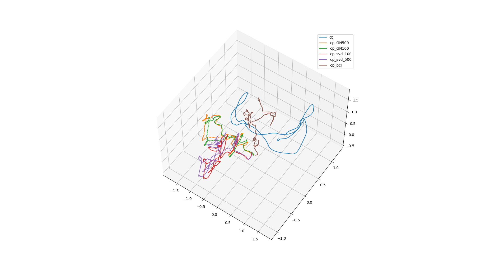

source code: https://github.com/suyunzzz/Iterative-Closest-Point-ICP-
## my_icp

1、实现基于svd的icp，见`src/icp_svd.cpp`

2、实现基于GN的icp，见`src/icp_GN.cpp`

## 参考

https://zhuanlan.zhihu.com/p/63964953

`src/icp_svd.cpp`中使用了`sophus`库，这是一个李代数计算库。有几点需要注意：
1. sophus依赖`fmt`这个库。
2. sophus的旧版本为非模板类，新版本为模板类。代码中使用的API为非模板类的版本。如果使用模板类，需要作相应修改。
3. 使用fmt时，必须加入这个声明`define FMT_HEADER_ONLY`，否则会报错`no reference to`。